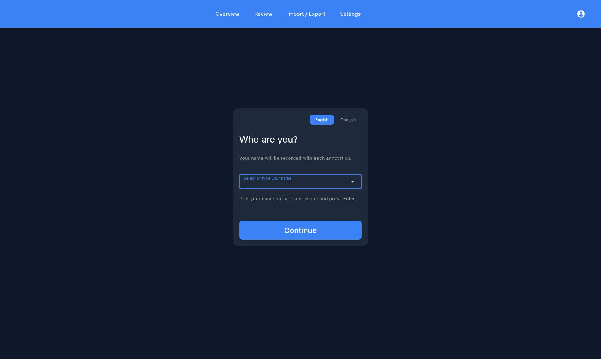
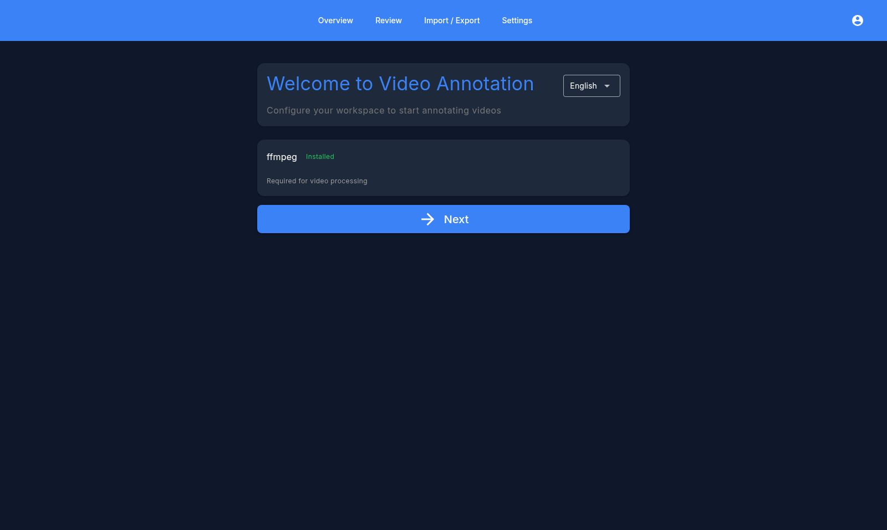
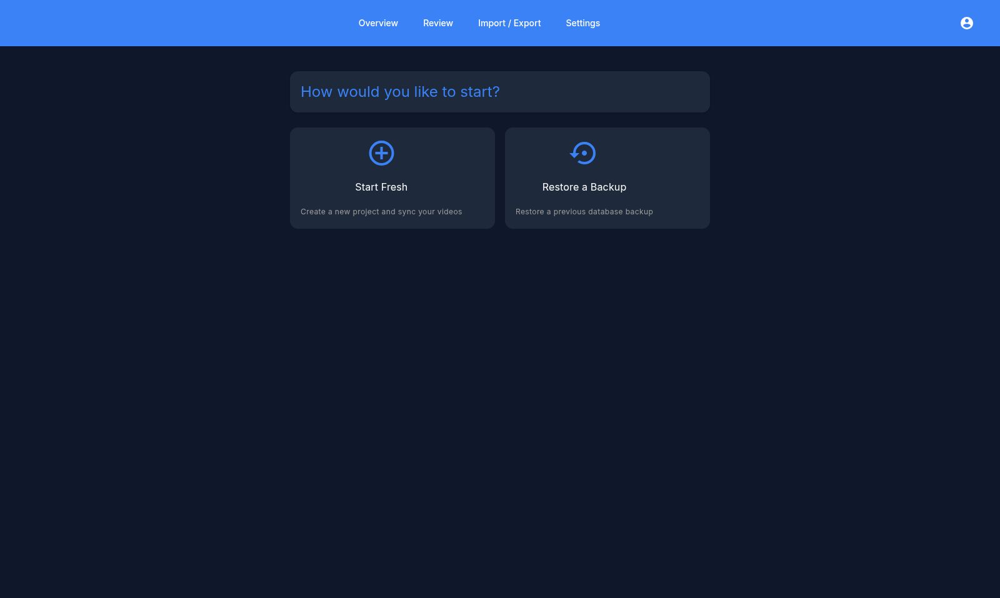
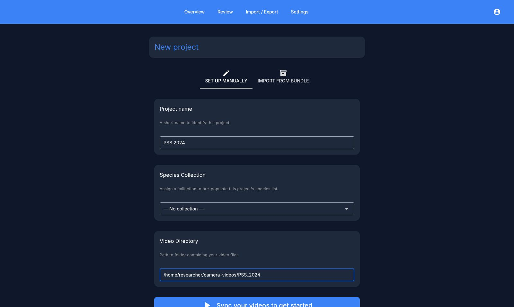
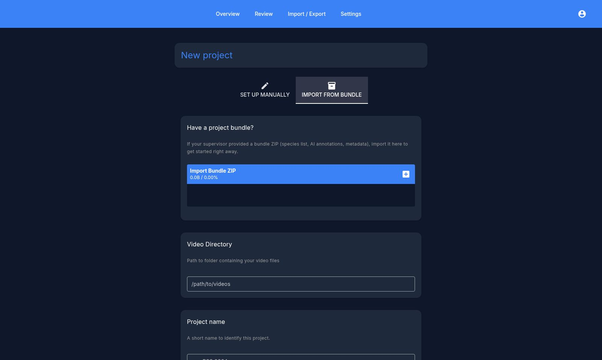
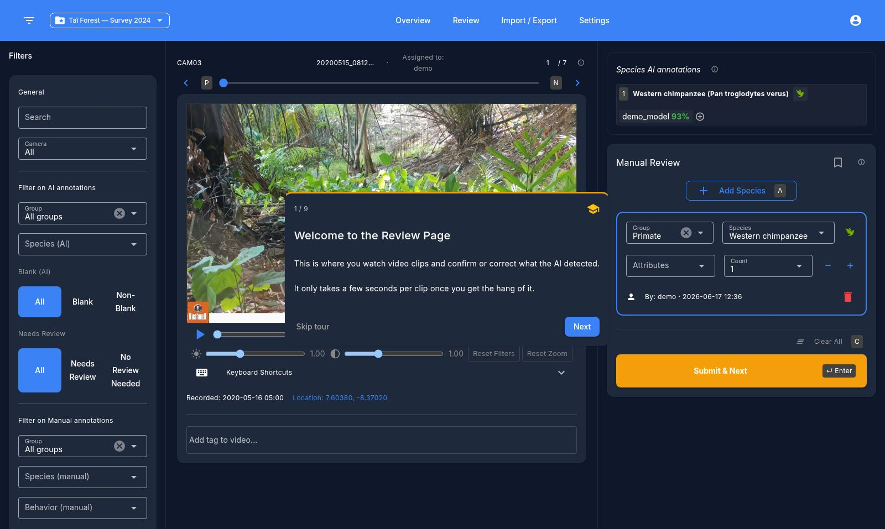

# Premiers pas

Cette page décrit tout le parcours, de l'installation de l'application à la revue de votre première vidéo.

## Installation

L'application est distribuée sous forme d'exécutable autonome pour Linux, Windows et macOS — aucune installation de Python n'est nécessaire. Téléchargez la version correspondant à votre système depuis la page [Releases](https://github.com/wild-chimpanzee-foundation/review-app/releases) du projet et lancez-la.

Il n'y a rien à installer en dehors de l'exécutable lui-même : la base de données, vos paramètres et les sauvegardes automatiques sont tous stockés dans un dossier utilisateur géré par l'application.

### ffmpeg

L'application a besoin de **ffmpeg** pour la lecture vidéo, les vignettes et la lecture des métadonnées vidéo. C'est un outil gratuit, à installer une seule fois, qui n'est pas fourni avec l'application : vous devez donc l'ajouter une fois. L'assistant de configuration le vérifie et affiche **Installé** lorsqu'il est prêt.

#### Windows

1. **Ouvrez un terminal (PowerShell).** Cliquez sur le menu **Démarrer**, tapez `powershell`, et cliquez sur **Windows PowerShell**. (Ou appuyez sur **Win + R**, tapez `powershell`, et appuyez sur Entrée.)
2. **Installez ffmpeg** en exécutant :

    ```powershell
    winget install ffmpeg
    ```

3. **Fermez le terminal et ouvrez-en un nouveau**, puis vérifiez que ça a fonctionné :

    ```powershell
    ffmpeg -version
    ```

    Si une bannière de version s'affiche, c'est terminé.

#### macOS / Linux

- **macOS :** `brew install ffmpeg` (installez d'abord [Homebrew](https://brew.sh) si nécessaire)
- **Linux :** `sudo apt install ffmpeg` (ou le gestionnaire de paquets de votre distribution)

Si vous installez ffmpeg alors que l'assistant de configuration est déjà ouvert, **redémarrez l'application** pour qu'elle revérifie, puis poursuivez une fois que le statut indique **Installé**.

## Premier lancement

Lors d'une nouvelle installation, aucune base de données n'existe encore : l'application vous guide donc à travers une courte configuration unique avant d'atteindre l'interface principale.

### 1. Indiquez qui vous êtes

Le premier écran demande votre nom. Chaque annotation que vous réalisez est associée à ce nom, ce qui permet à une équipe de répartir le travail et de suivre qui a revu quoi.



Choisissez votre nom dans la liste s'il y figure déjà, ou saisissez-en un nouveau et appuyez sur **Entrée**. Vous pouvez aussi changer la langue de l'interface (English / Français) depuis le sélecteur en haut à droite — ce choix est mémorisé et modifiable ensuite dans les Paramètres. Cliquez sur **Continuer**.

!!! note
    Ce nom vous identifie en tant qu'*annotateur* ; ce n'est pas un compte protégé par mot de passe. Sur une machine partagée, chaque personne sélectionne simplement son propre nom. Vous pouvez changer de nom plus tard depuis le menu compte en haut à droite de l'en-tête.

### 2. Bienvenue & vérification du système

L'assistant de configuration s'ouvre ensuite. La première étape confirme votre langue et vérifie que ffmpeg est disponible.



Une fois que ffmpeg indique **Installé**, cliquez sur **Suivant**.

### 3. Nouveau départ ou restauration

L'assistant demande ensuite comment vous souhaitez commencer :



- **Nouveau départ** — créer une base de données toute neuve et configurer votre premier projet. Choisissez cette option lors de la première utilisation.
- **Restaurer une sauvegarde** — charger un fichier de sauvegarde `.db` exporté précédemment. Utilisez-la pour transférer votre travail vers un nouvel ordinateur, ou pour récupérer après une réinstallation. Les sauvegardes déjà présentes vous sont proposées, et vous pouvez aussi téléverser un fichier `.db`.

### 4. Créez votre premier projet

Choisir **Nouveau départ** vous amène à la création de projet. Un **projet** est un nom associé à un dossier de vidéos de pièges photographiques sur le disque (voir [plus bas](#quest-ce-quun-projet)). Il y a deux onglets :

**Configurer manuellement** — pointez l'application vers un dossier de vidéos :



1. **Nom du projet** — une étiquette courte, par ex. `PSS 2024`.
2. **Collection d'espèces** *(optionnel)* — pré-remplit la liste d'espèces du projet à partir d'une collection enregistrée. Laissez sur *Aucune collection* en cas de doute ; vous pourrez configurer les espèces plus tard.
3. **Répertoire vidéo** — le chemin complet vers le dossier contenant vos vidéos. L'application le parcourt récursivement.
4. Cliquez sur **Synchronisez vos vidéos pour commencer**. L'application analyse le dossier, enregistre chaque vidéo trouvée et lit les métadonnées de base (durée, ainsi que l'horodatage/GPS si disponibles).

**Importer depuis un bundle** — si un collègue a préparé un bundle de projet pour vous :



Téléversez le bundle `.zip` (il peut contenir une liste d'espèces, des étiquettes, des annotations IA et des métadonnées), pointez le **Répertoire vidéo** vers votre copie locale des séquences, donnez un nom au projet, et l'application importe tout en une seule étape. C'est la méthode recommandée pour distribuer un projet prêt à revoir entre plusieurs annotateurs — voir [Importer les résultats du modèle](importing.md) et [Exporter les annotations](exporting.md) pour la production des bundles.

Une fois la synchronisation terminée, l'assistant propose d'aller directement à **Importer les résultats du modèle** ou d'ouvrir le **Tableau de bord**.

## Qu'est-ce qu'un projet

Un projet, c'est simplement un **nom + un dossier vidéo**. L'application parcourt ce dossier récursivement et enregistre chaque vidéo trouvée. Formats pris en charge : `mp4`, `avi`, `mov`, `mkv`, `webm`, `wmv`, `flv`, `m4v`.

Vous pouvez conserver plusieurs projets dans une même base de données et basculer entre eux depuis le menu déroulant à gauche de l'en-tête. Pour ajouter d'autres projets ensuite, utilisez le sélecteur de projet ou les **Paramètres**.

!!! note
    Les caméras n'ont pas besoin d'être configurées séparément — l'**identifiant de caméra de chaque vidéo est déduit automatiquement de la structure de vos dossiers** lors de la synchronisation. Organiser les séquences en `.../CAM01/clip.mp4`, `.../CAM02/clip.mp4` suffit pour que les statistiques par caméra et la répartition du travail fonctionnent.

Si vous ajoutez ou supprimez des fichiers sur le disque plus tard, relancez l'analyse depuis **Paramètres → Dossier vidéo → Synchroniser les vidéos** pour prendre en compte les changements.

## Configuration initiale

Une fois le projet créé, l'essentiel à configurer avant de commencer la revue est la **liste d'espèces** — seules les espèces activées apparaissent dans les contrôles d'annotation :

- Allez dans **Paramètres → Paramètres avancés → Espèces du projet** et activez les espèces pertinentes pour votre projet depuis le catalogue global, ou ajoutez des espèces personnalisées. (Si vous avez importé un bundle ou choisi une collection d'espèces, cette liste peut déjà être remplie.)

Vous pouvez aussi ajuster les **seuils de confiance** qui déterminent comment les prédictions de l'IA sont affichées — seuils pour vidéo vide, espèces et détection d'objets — dans **Paramètres → Paramètres avancés → Détection des vidéos vides**. Voir la page [Paramètres](settings.md) pour la référence complète.

## Votre première revue

La première fois que vous ouvrez l'écran **Revue**, une courte visite guidée met en évidence le lecteur vidéo, la file d'attente, les filtres et les contrôles d'annotation.



Parcourez-la avec **Suivant**, ou cliquez sur **Passer le tour** pour la fermer — dans tous les cas, elle ne réapparaîtra pas. À partir de là, vous êtes prêt à annoter ; voir [Revoir les vidéos](reviewing.md) pour le guide complet.

Suite : [Tableau de bord](dashboard.md)
