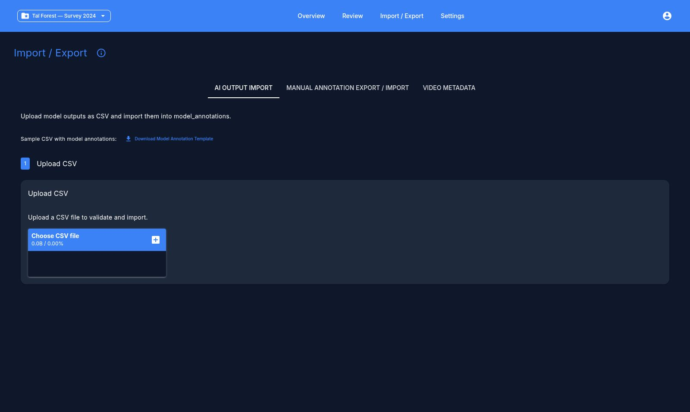

# Importing Model Results

Imports happen on the **Model Import** page, which has separate tabs for model annotations, historic/manual annotations, metadata, and bundles.

## AI model annotations

Two CSV shapes are accepted:

- **Long format** — one row per detection, with columns `video_path` (or `filepath` / `review_filename` / `original_filepath` / `path`), `annotation_type` (`species`, `blank_non_blank`, `behavior`, or `object_detection`), `model_name`, `value_text`, `value_num`, `probability`, `t_start_sec`, `t_end_sec`.
- **Wide format** — one row per video, with columns like `top_1_<model>` for the predicted species, `prob_<model>`, `count_<model>`, and blank-probability columns. The app detects this shape automatically and offers a column-mapping UI.

A downloadable CSV template is available on the import page if you're unsure of the expected columns.

### Import steps

1. **Upload** your CSV. The app suggests a path/column mapping automatically.
2. **Match preview** — shows how many video paths matched videos already in the project, with a sample of any unmatched paths.
3. **Validate** — checks the file and reports valid vs. invalid row counts, with a sample of valid rows.
4. **Review & map species** — any species name in the CSV that isn't in your project's species list shows up as unmapped. For each one you can map it to an existing species, add it as a new species, or ignore it.
5. **Import** — only this final step writes to the database. Validation and preview steps never modify your project.

!!! note
    Rows for species left unmapped are **skipped** on import, so the imported data matches exactly what you saw in the preview.

## Historic / manual annotations

For re-importing previously exported or external annotation spreadsheets. Supports either split path columns (folder + filename) or a single combined path column, with column pickers for species, behavior, count, observer, and timestamp. You choose whether the import should **override** existing annotations or **append** to them. The same species-mapping step applies, plus an option to map directly to "blank."

## App-format annotations

If your CSV is the app's own exported format (detected via `video_path`/`video_id` + `is_blank` columns), the app shows a dry-run summary of matched/skipped videos and observations to insert/update/delete before you confirm the import.

## Batch and bundle import

For distributing work across multiple annotators, you can import several files at once, or a single `.zip` bundle containing `species.csv`, `tags.csv`, `model_annotations.csv`, and `metadata.csv`.

Next: [Reviewing videos](reviewing.md)
