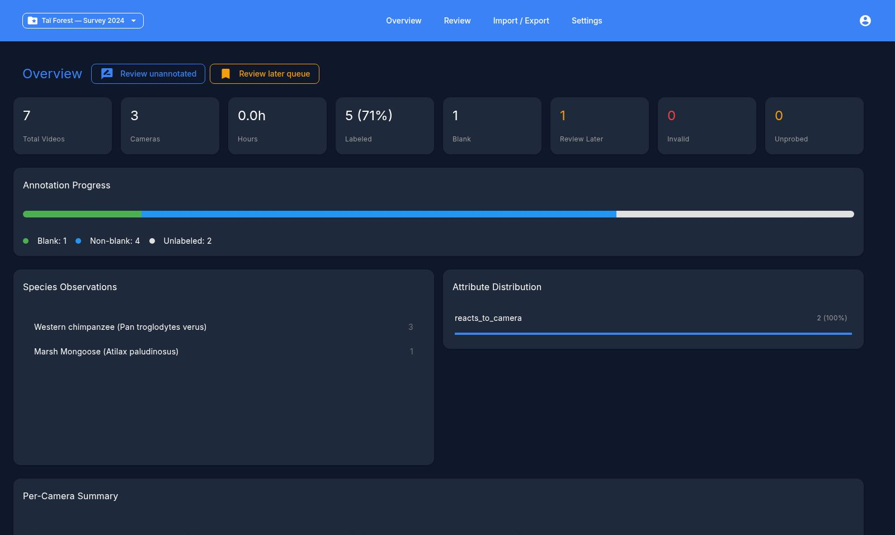

# Video Annotation Review App

A desktop app for manually reviewing camera trap footage and correcting AI model annotations. Built for small wildlife research teams.

## What it does

- **Import model results** — load AI species/behavior/blank predictions from CSV
- **Review videos** — step through footage with inline annotation controls, a video player with brightness/contrast adjustment, and keyboard shortcuts
- **Correct and label** — confirm, override, or add species and behavior annotations per video
- **Track progress** — overview dashboard showing annotation coverage, species distributions, and per-camera stats
- **Export** — save reviewed annotations as CSV

Supports multiple projects, English/French UI, dark mode, and configurable confidence thresholds.

Use the navigation above to get started.
