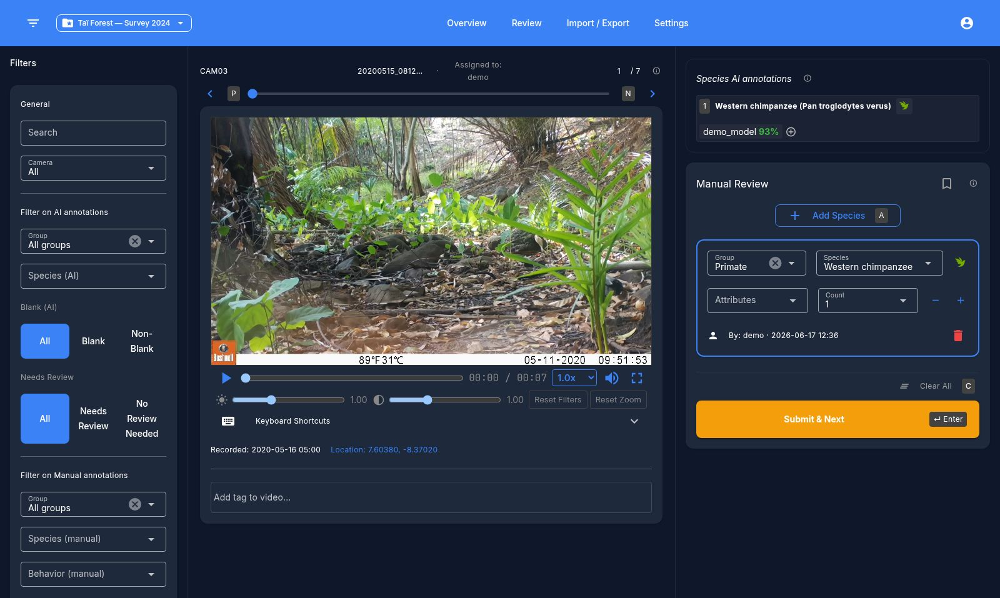

# Reviewing Videos

## Layout

The review screen has:

- A header with the project switcher and navigation.
- A left drawer with filters (species, camera, tags, annotation status, annotator, etc.) — fully toggleable.
- A center video player with a queue position bar (slider, prev/next buttons, and a numeric jump field).
- A right sidebar with collapsible AI-prediction summaries (species, object detection, blank) followed by the manual annotation panel.

## Video metadata

Each video shows its camera ID, filename, recorded timestamp, and GPS location (if present, with a clickable map popup). Missing metadata fields are flagged.

## Annotating

For each video you can:

- Mark the video as blank / not blank.
- Add one or more species annotations — each with a species, optional group filter, behavior/tag multi-select, and a count.
- Click an AI prediction chip to copy it directly into a manual annotation.
- Delete an annotation, or use **Clear annotations** to remove all annotations on the video.
- Toggle **Review later** to bookmark a video for a second pass.
- Toggle **tags** on the video — built-in tags include `fire`, `nice_shot`, and `broken_metadata`; you can also create custom tags.

## Video player controls

Play/pause, scrubber with time display, playback speed (0.25x–25x), mute, fullscreen, mouse-wheel zoom with click-drag pan, and **brightness/contrast** sliders (0.5–2.0) with a reset button.

## Keyboard shortcuts

A full list is available from the in-app help dialog. The most useful ones:

| Key | Action |
| --- | --- |
| Enter | Submit and go to next video |
| N / P | Next / previous video |
| M | Toggle review-later |
| A | Add species |
| C | Clear annotations |
| 1–9 | Add the Nth AI-predicted species/object as a manual annotation |
| J / K | Select next / previous annotation card |
| Tab | Focus the selected card's first field |
| X | Delete selected annotation |
| T | Focus the tag input |

Inside the video player:

| Key | Action |
| --- | --- |
| Space | Play / pause |
| ← / → | Seek ±5s |
| S / D | Speed down / up |
| [ / ] | Brightness down / up |
| { / } | Contrast down / up |
| Z | Reset zoom |
| R | Reset brightness/contrast |
| F | Fullscreen |

Next: [Exporting annotations](exporting.md)
