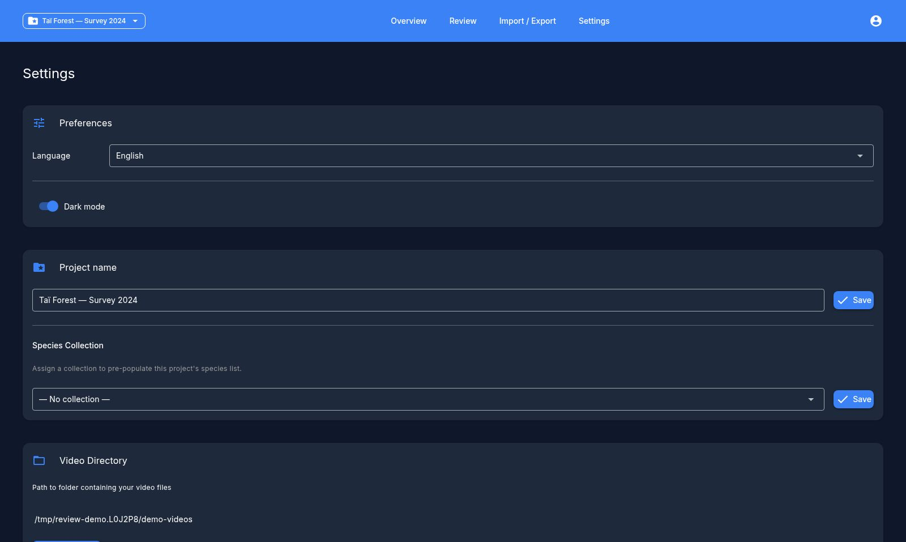

# Paramètres

La page **Paramètres** regroupe tout ce qui configure l'application et le projet actif. Les contrôles les plus utilisés sont en haut ; les opérations moins fréquentes et destructrices se trouvent sous **Paramètres avancés**.

## Préférences

- **Langue** — basculer l'interface entre l'anglais et le français (recharge l'application).
- **Mode sombre** — activer le thème clair/sombre.

## Projet

Affiché lorsqu'un projet est actif :

- **Nom du projet** — renommer le projet actif.
- **Collection** — regrouper le projet sous une collection nommée, ou le laisser sans catégorie.

## Dossier vidéo

Affiche le dossier sur le disque que le projet actif analyse pour trouver des vidéos.

- **Synchroniser les vidéos** — réanalyser le dossier. Les nouvelles vidéos sont enregistrées ; les vidéos absentes du disque sont signalées. Une fenêtre de progression indique combien ont été analysées, ajoutées et supprimées.
- **Supprimer les vidéos manquantes** — si des vidéos de la base de données n'existent plus sur le disque, un décompte apparaît ici avec un bouton pour supprimer ces enregistrements (confirmation requise).

## Paramètres avancés

Une section dépliable regroupant la configuration plus poussée :

### Espèces du projet

Activez les espèces pertinentes pour votre projet depuis le catalogue global, ou ajoutez des espèces personnalisées. Seules les espèces activées apparaissent dans les contrôles d'annotation. C'est l'élément principal à configurer avant de commencer la révision — voir [Premiers pas](getting-started.md).

### Étiquettes

Gérez les étiquettes pouvant être appliquées aux vidéos. Les étiquettes intégrées (comme `fire`, `nice_shot`, `broken_metadata`) sont toujours disponibles ; vous pouvez ajouter des étiquettes personnalisées ici.

### Détection des vidéos vides

Trois curseurs de seuil de confiance (0.0–1.0) qui contrôlent l'affichage des prédictions de l'IA :

- **Seuil vidéo vide** — niveau de confiance requis pour considérer une vidéo comme vide.
- **Seuil espèces** — probabilité minimale pour qu'une prédiction d'espèce soit affichée.
- **Seuil de détection d'objets** — probabilité minimale pour qu'une détection d'objet soit affichée.

Cliquez sur **Enregistrer** pour appliquer.

### Distribution

Répartissez les vidéos d'un projet entre plusieurs annotateurs afin que chacun revoie sa propre part.

1. Ajoutez les noms des annotateurs à qui répartir.
2. Affectez les caméras aux annotateurs manuellement, ou utilisez **Distribution automatique** pour répartir les caméras équitablement.
3. **Appliquer** pour enregistrer les affectations ; **Réinitialiser** les efface.

Un tableau récapitulatif montre les caméras, vidéos et heures de chaque annotateur. Le même panneau propose :

- **Export par bundle** — télécharger un bundle de projet `.zip` par annotateur à transmettre.
- **Export ZIP vidéo** — regrouper les fichiers vidéo affectés à chaque annotateur dans des ZIP, dans un dossier de sortie de votre choix.

Les affectations apparaissent sur le [tableau de bord](dashboard.md#recapitulatif-des-affectations) et comme filtre d'annotateur sur l'écran de révision.

### Utilisateurs / annotateurs

Liste toutes les personnes qui se sont connectées comme annotateur, avec leur nombre d'annotations. Vous pouvez supprimer un annotateur sans annotation — les annotateurs ayant des annotations existantes (et votre propre nom actuel) ne peuvent pas être supprimés.

### Gestion de la base de données

- **Sauvegarde** — télécharger un instantané `.db` de toute la base de données.
- **Restauration** — remplacer la base de données actuelle à partir d'une sauvegarde précédente (une sauvegarde de sécurité est d'abord effectuée).
- **Supprimer les annotations du modèle** — supprimer toutes les prédictions de l'IA importées tout en conservant vos annotations manuelles.
- **Réinitialiser la base de données** — tout effacer et repartir de zéro (une sauvegarde est d'abord effectuée). Destructeur — confirmation requise.

## Diagnostics

En bas de la page :

- **Télécharger le journal** — enregistrer `app.log` à envoyer lors d'un signalement de problème.
- **Vérifier les mises à jour** — comparer votre version à la dernière publiée et, si plus récente, proposer un lien de téléchargement (une sauvegarde est effectuée avant la mise à jour).
